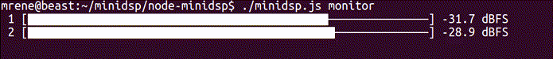

# node-minidsp-ddrc24
This is a fork of Mrene's node-minidsp, optimized for use with the DDRC-24.  It provides a command line interface to control the DDRC-24 directly via USB HID. It was developped using the plugin version 107 (September 2016) and contains minimal functionality to operate the device under Linux.

DISCLAIMER: The stock miniDSP plugin relies on last-change timestamps to synchronize its state. Changing some properties through this tool may reset that timestamp and force the configuration to be reloaded the next time the official application connects to the device. Backup your configuration first.



## Installation
```
npm install -g minidsp
```

In order to run as a non-privileged user under Linux, you may have to add a udev rule for this specific device. Under `/etc/udev/rules.d`, create a file named `99-minidsp.rules` containing:

```
# MiniDSP DDRC-24
ATTR{idVendor}=="2752", ATTR{idProduct}=="0044", MODE="660", GROUP="plugdev"
```

Then reload using:

```
sudo udevadm control --reload-rules
```


## Usage
```
$ minidsp  --help

  Usage: minidsp [options] [command]


  Commands:

    devices            List available devices
    input <source>     Set input source (Analog/TOSLINK/USB)
    config <index>     Set active configuration [0-3]
    mute [enable]      Set global mute flag
    gain <gain>        Set master gain level (-127 dB to 0 dB)
    input-gain <gain>  Set input gain level (-127 dB to 12 dB)
    monitor            Monitor input levels
    proxy              Run proxy on port 5333 (for mobile application or sniffing)
    dirac <state>      Set Dirac Live processing flag

  Options:

    -h, --help                  Print usage information
    -V, --version               Print version number
    -t --transport <transport>  Set underlying transport type (usb, net)
    -o --opt <opt>              Set transport-specific parameters
```


### Proxy mode
The plugin application itself uses a helper application communicating via TCP to localhost:5333. This is also the protocol used by the mobile application to provide its remote control interface. Running the application as a proxy will open that port and relay messages to and from the USB interface.

The plugin's Mac version will first attempt a connection before launching the helper application. You can forward it to another machine via `socat` like this: `socat TCP-LISTEN:5333 TCP:192.168.1.144:5333` 

### Transport
This tool can either talk to the device via USB, or to the proxy running externally.

To control a remote device from the command line, use the following syntax:
```
minidsp -t net -o "host=ip-here" [command]
```

### Working with multiple devices
You can list the available device paths via `minidsp devices` and then use `-o path=[path-here]` to communicate with a specific device.


### Examples

* Set gain to -20dB: `minidsp gain -- -20`
* Switch active input to USB: `minidsp input usb`
* Monitor: `minidsp monitor`
* Enable Dirac Live: 'minidsp dirac enable'


